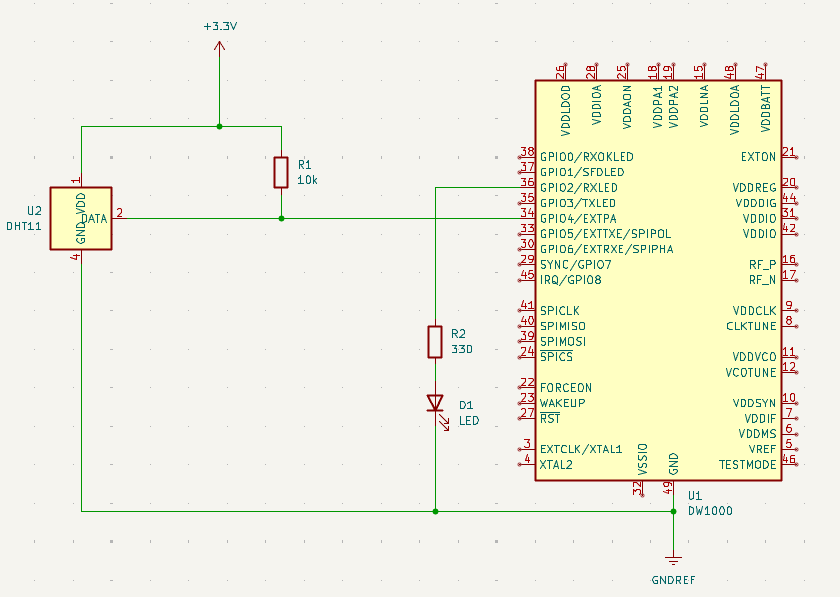
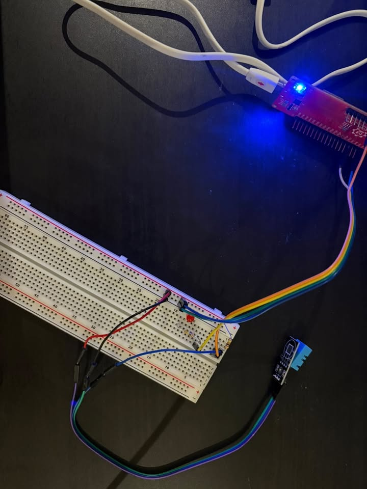
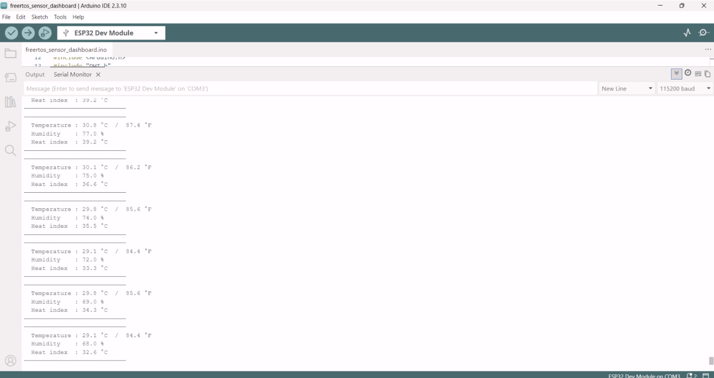

# FreeRTOS Real-Time Sensor Dashboard

A multitasking embedded firmware project on the **ESP32-WROOM-32E** that uses **FreeRTOS** to run two independently scheduled tasks — an LED status blink and a DHT11 temperature/humidity read — concurrently on separate CPU cores, streaming live sensor data over **UART**.

---

## Table of Contents

- [Overview](#overview)
- [Hardware](#hardware)
- [Wiring](#wiring)
- [Schematic](#schematic)
- [Software Setup](#software-setup)
- [How It Works](#how-it-works)
- [Build Photo](#build-photo)
- [Serial Output](#serial-output)
- [Troubleshooting Notes](#troubleshooting-notes)
- [License](#license)

---

## Overview

This project demonstrates real-time multitasking on a dual-core microcontroller using FreeRTOS:

- **LED Blink Task** — pinned to Core 0, toggles an LED every 1 second using `vTaskDelay()`.
- **DHT11 Sensor Task** — pinned to Core 1, reads temperature and humidity every 2 seconds and streams the results over UART.

Both tasks run independently and never block one another, since `vTaskDelay()` yields control back to the FreeRTOS scheduler instead of halting the CPU like a plain `delay()` call would.

---

## Hardware

| Component | Spec | Qty |
|---|---|---|
| Microcontroller | ESP32-WROOM-32E (dual-core, 240 MHz) | 1 |
| Sensor | DHT11 Temperature/Humidity sensor (bare 3-pin) | 1 |
| LED | Any color, standard indicator LED | 1 |
| Resistor | 330 Ω (or close, e.g. 340 Ω) — LED current limit | 1 |
| Resistor | 10 kΩ — DHT11 data line pull-up | 1 |
| Breadboard + jumper wires | — | 1 set |
| USB cable | Data-capable (not charge-only) | 1 |

---

## Wiring

| ESP32 Pin | Connects To | Function |
|---|---|---|
| 3.3V | DHT11 `+` (VCC) | Sensor power |
| GND | DHT11 `-` (GND) | Sensor ground |
| GPIO4 | DHT11 `out` (DATA) | Single-wire digital data |
| GPIO2 | 330 Ω resistor → LED anode | LED drive signal |
| GND | LED cathode | LED return path |

A 10 kΩ pull-up resistor bridges the DHT11 data line to 3.3V — required since the bare DHT11 has no resistor built in.

---

## Schematic



> KiCad capture of the circuit's electrical connections. Pin numbers shown are the IC-level pinout for the module footprint used in the schematic library; refer to the [Wiring](#wiring) table above for the GPIO labels as silkscreened on the ESP32-WROOM-32E dev board itself.

---

## Software Setup

1. Install the **Arduino IDE** (2.x recommended).
2. Add ESP32 board support: **File → Preferences → Additional Board Manager URLs**:
   ```
   https://raw.githubusercontent.com/espressif/arduino-esp32/gh-pages/package_esp32_index.json
   ```
3. Install board package: **Tools → Board → Boards Manager** → search `esp32` → install.
4. Install libraries via **Library Manager**:
   - `DHT sensor library` (by Adafruit)
   - `Adafruit Unified Sensor` (dependency)
5. Select **Tools → Board → ESP32 Arduino → ESP32 Dev Module**.
6. Select the correct **Port** (check Device Manager / `ls /dev/tty*` if unsure).
7. Upload, then open **Serial Monitor** at **115200 baud**.

---

## How It Works

```cpp
xTaskCreatePinnedToCore(ledBlinkTask, "LED_Blink", 1024, NULL, 1, &ledTaskHandle, 0);
xTaskCreatePinnedToCore(dhtSensorTask, "DHT11_Sensor", 4096, NULL, 1, &dhtTaskHandle, 1);
```

- `xTaskCreatePinnedToCore()` spawns each task on a specific core (0 or 1), giving true hardware parallelism rather than cooperative time-slicing on a single core.
- `vTaskDelay(pdMS_TO_TICKS(ms))` converts a millisecond duration into RTOS ticks and yields the task back to the scheduler for that duration — non-blocking, unlike `delay()`.
- The DHT task's 2-second period matches the DHT11's own minimum reliable sampling interval.
- The DHT task stack is sized at 4096 bytes (not 2048) to safely accommodate the DHT library's read routine plus floating-point `Serial.printf()` formatting — an earlier 2048-byte allocation caused a stack-canary crash.

---

## Build Photo



ESP32-WROOM-32E (top), LED with current-limiting resistor (center-left), and DHT11 sensor (bottom-right) on the breadboard.

---

## Serial Output



Live temperature, humidity, and computed heat-index readings streamed from the DHT11 task every 2 seconds at 115200 baud, while the LED task runs independently on the other core.

Example output:
```
╔══════════════════════════════╗
║  FreeRTOS Sensor Dashboard   ║
╚══════════════════════════════╝
[LED Task] Started on core 0
[DHT Task] Started on core 1
────────────────────────────
  Temperature : 25.9 °C  /  78.6 °F
  Humidity    : 30.0 %
  Heat index  : 25.3 °C
────────────────────────────
```

---

## Troubleshooting Notes

- **"Failed to read from DHT11 sensor"** — check the 10 kΩ pull-up between DATA and 3.3V, confirm pin order (`+ / out / -`), and reseat all three jumper wires.
- **`Guru Meditation Error: Stack canary watchpoint triggered`** — increase the affected task's stack size in `xTaskCreatePinnedToCore()`.
- **`Guru Meditation Error: Interrupt wdt timeout`** — usually means the DHT11 isn't responding at all (hardware/wiring fault), causing the library's blocking read loop to trip the watchdog.
- **Upload fails / "chip stopped responding"** — almost always a USB cable or port issue; try a different (data-capable) cable and a direct USB port rather than a hub.
- **Garbled Serial Monitor text** — baud rate mismatch; set the Serial Monitor dropdown to 115200 to match `Serial.begin(115200)` in the code.

---

## License

This project is provided as-is for educational purposes.
